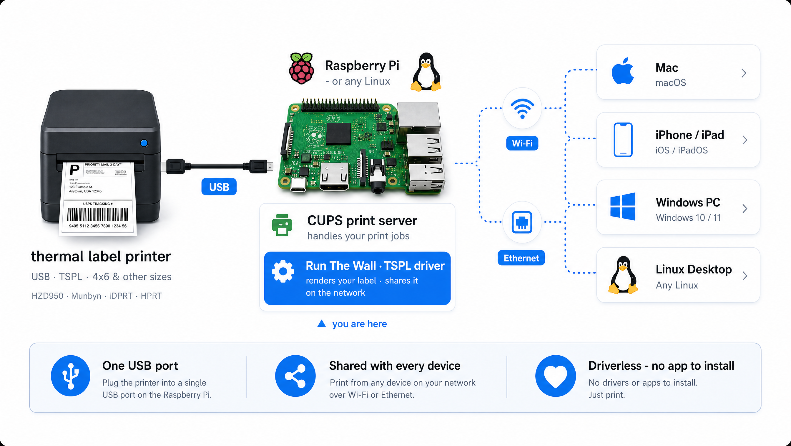

<p align="center">
  
</p>

<h1 align="center">tspl-cups-driver</h1>

<p align="center">
  <b>A free, open-source CUPS driver for cheap USB thermal label printers that speak TSPL/TSPL2.</b><br>
  Turn a USB-tethered label printer into a <b>shared network printer for every device</b> —
  Mac, iPhone, Windows, Linux — driverless.<br>
  Runs on <b>Linux &amp; Raspberry Pi (arm64 / armhf)</b>, the platforms the vendor drivers leave out.
</p>

<p align="center">
  <a href="https://github.com/RunTheWall/tspl-cups-driver/actions/workflows/ci.yml"></a>
  <a href="https://github.com/RunTheWall/tspl-cups-driver/releases/latest"></a>
  <a href="LICENSE"></a>
</p>

<p align="center">
  <b>Runs on</b>
  
  
  
  
  <br><br><b>Prints from</b>
  
  
  
  
</p>

> 💙 **Maintained for free by [Run The Wall](https://constly.com).** We don't want your money — we give
> away tools like this to introduce you to **[Constly, our genuinely great free Markdown editor →
> constly.com](https://constly.com)**. If it saved you an afternoon, that's the whole payment we wanted.
> *(The driver logs one thank-you line to your CUPS log per job — no tracking, no phone-home.)*

## Supported printers

Cheap 4×6 USB label printers mostly speak the **same TSPL/TSPL2** language and mostly lack an ARM/Linux
driver — so one driver covers them. We can only physically test the printers we own, so support is graded
honestly:

**✅ Confirmed working** (verified on real hardware): **HZD950-PRO / HERO**.

Everything else is 🟢 **TSPL-confirmed** (vendor/community docs say it speaks TSPL and our command set
*should* drive it) or 🟡 **community-reported** — **not yet verified by us.**
**[Got one working?](https://github.com/RunTheWall/tspl-cups-driver/issues)** Tell us and we'll move it to
Confirmed and add its USB id to auto-detect.

| Printer | dpi | USB id | Status |
|---|---|---|---|
| **HZD950-PRO / HERO** | 300 | `0fe6:811e` | ✅ **Tested** |
| **Munbyn ITPP941 / 941B** (941P: see note) | 203 | `09c6:0426` / generic | 🟢 TSPL |
| **iDPRT SP410 / SP420** | 203 | `20d1:7008` | 🟢 TSPL |
| **HPRT N41 / SL42** | 203 | `20d1` family (inferred) | 🟢 TSPL |
| **Beeprt BY-426** (shared OEM engine) | 203 | `09c6:0426` | 🟢 TSPL |
| **JADENS JD-168 / JD-268BT** | 203 | `09c6:0426` | 🟢 TSPL |
| **Polono PL420** | 203 | unknown | 🟡 community |
| **Xprinter XP-420B / 460B / 470B** | 203 | `2d84:b528` (460B) / varies | 🟢 TSPL |
| **Phomemo PM-241 / D520** | 203 | (unverified) | 🟡 community |

<sub>Munbyn's vendor specs list the 941 / 941B as 203 dpi TSPL; the 300 dpi "941P 3.0" has no public
spec confirming TSPL yet, and the AirPrint "941AP" speaks OPL (excluded below). Polono is grouped with
the TSPL clone family by community reports, but the oft-repeated "HPRT rebadge" claim has no public
evidence (different FCC grantees), so it stays 🟡 until someone reports one.</sub>

**Check yours in 10 seconds** (prints nothing): `cat /sys/class/usbmisc/lp0/device/ieee1284_id` —
most TSPL printers self-describe with `CMD:TSPL` (or `TSPL2`) in there, no driver needed. You can also
ask the printer itself: `printf '~!T\r\n' | sudo tee /dev/usb/lp0 >/dev/null; sudo timeout 2 head -c 32
/dev/usb/lp0` — but many clones are **write-only over USB**, so no reply proves nothing; go by the id
string or just try a print.

**Not this driver** (different language): Munbyn **AirPrint / "OPL"** models (use AirPrint directly),
**Phomemo M110 / M120 / D30 / M02** & mini printers (**ESC/POS**), **Brother QL** / **DYMO** (proprietary
raster), **Zebra** (ZPL/EPL — already well-supported), and **Rollo / OFFNOVA** (TSPL, but they ship their
own arm64 drivers).

## Install

### 1 · Add the package repo — recommended

Add it once, then install and **upgrade by name** like any system package. Signed, hosted free on GitHub Pages.

```bash
# Debian / Ubuntu / Raspberry Pi OS
curl -fsSL https://runthewall.github.io/tspl-cups-driver/apt/KEY.gpg | sudo tee /usr/share/keyrings/tspl.gpg >/dev/null
echo "deb [signed-by=/usr/share/keyrings/tspl.gpg] https://runthewall.github.io/tspl-cups-driver/apt ./" | sudo tee /etc/apt/sources.list.d/tspl.list
sudo apt update && sudo apt install tspl-cups-driver
```
```bash
# Fedora / RHEL / openSUSE
sudo curl -fsSL https://runthewall.github.io/tspl-cups-driver/rpm/tspl.repo -o /etc/yum.repos.d/tspl.repo
sudo dnf install tspl-cups-driver
```

### 2 · Or the all-in-one script (also shares it + prints a welcome label)

```bash
git clone https://github.com/RunTheWall/tspl-cups-driver
cd tspl-cups-driver && sudo ./install.sh
```
Builds from source if you have a compiler; otherwise **downloads a prebuilt binary for your CPU** (no
build tools needed). Turns on network sharing + AirPrint on the way.

### Create the print queue

Packages install the driver files only; create a queue once (the script does this for you). Name it
anything — `HZD950` is just the default:

```bash
sudo lpadmin -p HZD950 -E -v tspl://auto -P /usr/share/ppd/tspl/tspl-label.ppd \
     -o printer-is-shared=true -o media=na_index-4x6_4x6in
# 203 dpi printer?  add:  -o Resolution=203dpi
```

`tspl://auto` finds a known TSPL printer. If yours has an unlisted USB id, the backend prints the id it
sees — pin it with `-v tspl://<vid>:<pid>` or `-v tspl:///dev/usb/lp0` (and please
[open an issue](https://github.com/RunTheWall/tspl-cups-driver/issues) with the id so we auto-detect it).

<details>
<summary>Also: one-off <code>.deb</code>/<code>.rpm</code> download · Arch (AUR / PKGBUILD) · NixOS</summary>

Every release is built by GitHub Actions for **amd64 / arm64 / armhf** — grab one from
[**Releases**](https://github.com/RunTheWall/tspl-cups-driver/releases/latest):

```bash
sudo apt install ./tspl-cups-driver_*_arm64.deb        # Debian/Ubuntu/Pi (or _amd64 / _armhf)
sudo dnf install ./tspl-cups-driver-*.x86_64.rpm       # Fedora/RHEL (or .aarch64)

# Arch — build the shipped PKGBUILD (AUR listing pending):
( cd tspl-cups-driver/packaging/aur && makepkg -si )

# NixOS — add to your CUPS drivers:
#   services.printing.drivers = [ inputs.tspl.packages.${pkgs.system}.default ];
#   flake input: github:RunTheWall/tspl-cups-driver
```
Packaging sources live in [`packaging/`](packaging/) and [`flake.nix`](flake.nix).
</details>

## Connect from a Mac / iPhone / PC — no driver

The Pi renders, so **clients never install a driver** — they just add the shared queue.

- **Mac / iPhone / iPad** — it appears in **Add Printer** as **AirPrint**; pick it, done. (`install.sh`
  applies the one server-side fix that makes this work: `BrowseDNSSDSubTypes _print,_universal` in
  `cupsd.conf`, so macOS offers driverless AirPrint instead of a wrong "Generic PostScript" driver.)
- **Windows 10/11 · Linux** — auto-discovered as an IPP Everywhere / Mopria printer; add it driverless.
- **Helpers** — [`client/add-printer.command`](client/add-printer.command) (Mac; auto-discovers over
  Bonjour) and a downloadable [`.mobileconfig`](client/RTW-HZD950-airprint.mobileconfig) profile.

## Print options

| Option | Values | → TSPL |
|---|---|---|
| **Print Mode** (halftone) | **Default** (threshold — crisp text/barcodes) · **Gathering** (dither — greys/photos) · None · Diffusion · Error Diffusion | — (rendered into the bitmap) |
| **Darkness** | `0`–`15` (default 8) | `DENSITY` |
| **Print Speed** | `1`–`6` in/sec (default 4) · Printer default (sends nothing) | `SPEED` |
| **Media tracking** | **Die-cut (gap)** · Black-mark · Continuous · Printer setting | `GAP` / `BLINE` |
| **Resolution** | `203` / `300` dpi | — |

Loaded **black-mark or continuous stock** instead of die-cut labels? Set it per queue —
`-o MediaTracking=BlackMark` or `Continuous` — sending the default gap-sensor command to gapless
media makes the printer hunt for a gap and error out. And after any media change, run the printer's
**hold-the-feed-button calibration** and make sure the queue's page size matches the physical labels:
TSPL firmwares skip or garble labels when `SIZE` disagrees with the stock.

<details>
<summary><b>Two queues: crisp labels + a "photo" (Gathering) queue</b></summary>

**Print Mode** is a halftone choice and the best one depends on content — **Default** (threshold) for crisp
text/barcodes/QR, **Gathering** (clustered-dot dither) for greys/photos/watermarks. The filter honours each
queue's **PPD default**, so run **two queues on the same printer** and pick per job:

```bash
# crisp labels (Default / threshold)
sudo lpadmin -p HZD950 -E -v tspl://auto -P /usr/share/ppd/tspl/tspl-label.ppd \
  -o printer-is-shared=true -o PrintMode=5 -o Darkness=8 -o PrintSpeed=50
# photo / Gathering (greys, watermarks)
sudo lpadmin -p HZD950-Photo -E -v tspl://auto -P /usr/share/ppd/tspl/tspl-label.ppd \
  -o printer-is-shared=true -o PrintMode=3 -o Darkness=7 -o PrintSpeed=20
```
Baked into the queue default, this works even for driverless clients (AirPrint/IPP-Everywhere) that can't
show the option menus — they just pick the right queue. Values: **PrintMode** `5`=Default `3`=Gathering
`0`=None `2`=Diffusion `4`=ErrorDiffusion · **Darkness** `0`–`15` · **PrintSpeed** = in/sec ×10
(`0` = leave it to the printer) · **MediaTracking** `Gap`/`BlackMark`/`Continuous`/`PrinterDefault`.
</details>

<details>
<summary><b>How it works · build from source · multiple printers · notes</b></summary>

```
your app ─► CUPS ─► gstoraster ─► rastertotspl ─► TSPL ─► tspl backend ─► printer
                                  (this repo)             (this repo)
```

- **`rastertotspl`** (C filter) reads the CUPS raster and emits TSPL —
  `SIZE / GAP|BLINE / DENSITY / SPEED / DIRECTION / REFERENCE / CLS / BITMAP … / PRINT`. The 8-bit page is
  flattened to 1-bit dots with the selected **Print Mode** dither (bitmaps, not printer fonts — so no
  per-model font quirks).
- **`tspl`** (shell backend) writes the TSPL straight to the printer's `usblp` device, located **by USB
  id/serial** so it survives reboots and coexists with other USB printers.

**Build from source:** needs `gcc`, `make`, CUPS dev headers (`sudo apt install build-essential libcups2-dev`,
or the dnf/pacman/zypper equivalent), then `make`.

**Multiple USB printers?** `tspl://auto` only matches known TSPL ids (never a laser); pin others by
`vid:pid`/node. Drop in [`udev/99-tspl-label.rules`](udev/99-tspl-label.rules) for a stable
`/dev/usb/tspl-label` symlink.

**Notes:** CUPS 2.4 prints a "printer drivers are deprecated" warning — harmless; classic PPD+filter
drivers work for years yet. Reverse-engineered cleanly from the printer's own TSPL output; no vendor code
is redistributed.
</details>

## Something not working? Tell us 🖨️

It's free, but we do want it to actually work for you — and **your report is how the
[Supported printers](#supported-printers) list grows.** No hoops, just GitHub Issues:

- **Your printer works — or doesn't?** → [**Open a printer report**](https://github.com/RunTheWall/tspl-cups-driver/issues/new?template=printer-report.yml).
  It asks for your model, `lsusb` USB id, the `~!T` reply, and your distro/arch. Confirmed printers move
  to ✅ and get added to auto-detect.
- **Hit a bug?** → [**Open a bug report**](https://github.com/RunTheWall/tspl-cups-driver/issues/new?template=bug.yml)
  with your CUPS error log (`/var/log/cups/error_log` — please redact hostnames/IPs).
- **Just a question?** → [open an issue](https://github.com/RunTheWall/tspl-cups-driver/issues/new) anyway; we read them all.

If the driver saved you time, the nicest thank-you is trying [Constly](https://constly.com) 💙.

## License

MIT © Run The Wall. See [LICENSE](LICENSE). Built and maintained for free — support us by trying
**[Constly, our free Markdown editor → constly.com](https://constly.com)**.
